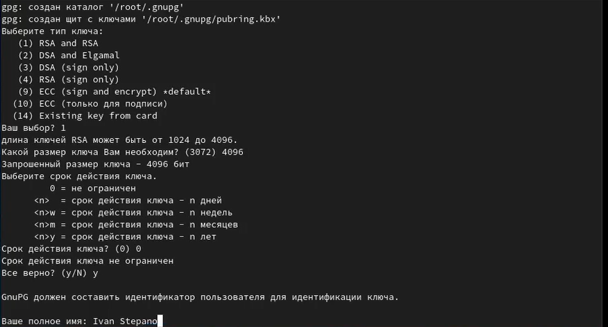
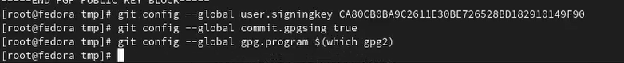

---
## Front matter
title: "Лабораторная работа №2"
author: "Степанов Иван Юрьевич"

## Generic otions
lang: ru-RU
toc-title: "Содержание"

## Bibliography
bibliography: bib/cite.bib
csl: pandoc/csl/gost-r-7-0-5-2008-numeric.csl

## Pdf output format
toc: true # Table of contents
toc-depth: 2
lof: true # List of figures
lot: true # List of tables
fontsize: 12pt
linestretch: 1.5
papersize: a4
documentclass: scrreprt
## I18n polyglossia
polyglossia-lang:
  name: russian
  options:
	- spelling=modern
	- babelshorthands=true
polyglossia-otherlangs:
  name: english
## I18n babel
babel-lang: russian
babel-otherlangs: english
## Fonts
mainfont: PT Serif
romanfont: PT Serif
sansfont: PT Sans
monofont: PT Mono
mainfontoptions: Ligatures=TeX
romanfontoptions: Ligatures=TeX
sansfontoptions: Ligatures=TeX,Scale=MatchLowercase
monofontoptions: Scale=MatchLowercase,Scale=0.9
## Biblatex
biblatex: true
biblio-style: "gost-numeric"
biblatexoptions:
  - parentracker=true
  - backend=biber
  - hyperref=auto
  - language=auto
  - autolang=other*
  - citestyle=gost-numeric
## Pandoc-crossref LaTeX customization
figureTitle: "Рис."
tableTitle: "Таблица"
listingTitle: "Листинг"
lofTitle: "Список иллюстраций"
lotTitle: "Список таблиц"
lolTitle: "Листинги"
## Misc options
indent: true
header-includes:
  - \usepackage{indentfirst}
  - \usepackage{float} # keep figures where there are in the text
  - \floatplacement{figure}{H} # keep figures where there are in the text
---

# Цель работы

- Изучить идеологию и применение средств контроля версий. 
- Освоить умения по работе с git.

# Задание

- Создать базовую конфигурацию для работы с git.
- Создать ключ SSH.
- Создать ключ PGP.
- Настроить подписи git.
- Зарегистрироваться на Github.
- Создать локальный каталог для выполнения заданий по предмету.

# Выполнение лабораторной работы

создаем учетную запись на сайте https://github.com/ и заполняем ее. она была создана у меня ранее, поэтому я пропустил этот пункт

устанавливаем gh и gitflow, для этого я получил права суперпользователя, но скачать git-flow у меня так и не получилось, скачал только gh 
(рис. [-@fig:002])

{ #fig:002 width=70% }  

(рис. [-@fig:003])

{ #fig:003 width=70% }

далее совершаем базовую настройку git 

(рис. [-@fig:004])

{ #fig:004 width=70% }

создаем ключи ssh
(рис. [-@fig:005])

{ #fig:005 width=70% }

создаем ключ pgp и добавляем его на гитхаб 

(рис. [-@fig:006] ) 

{ #fig:006 width=70% }  

(рис. [-@fig:007] ) 

{ #fig:007 width=70% }  

(рис. [-@fig:008] ) 

{ #fig:008 width=70% }  

(рис. [-@fig:009] ) 

{ #fig:009 width=70% }  

 (рис. [-@fig:010])

{ #fig:010 width=70% }

настраиваем автомотические подписи коммитов гит 

(рис. [-@fig:011])

{ #fig:011 width=70% }

авторизовываемся в консоли с помощью команды "gh auth login" 

(рис. [-@fig:012])

{ #fig:012 width=70% }

с помощью шаблона рабочего пространства создаем репозиторий на своем гитхабе 

(рис. [-@fig:013] ) 

{ #fig:013 width=70% }  

(рис. [-@fig:014])

{ #fig:014 width=70% }

настраиваем каталог курса: удаляем ненужные файлы, создаем необходимые каталоги и отправляем файлы на сервер 

(рис. [-@fig:015])

{ #fig:015 width=70% }

# Выводы

я узнал про VCS, а так же на практике получил навыки по работе с git.
