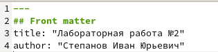

---
## Front matter
lang: ru-RU
title: Отчёт по лабораторной работе №3
author: Степанов Иван Юрьевич
institute: РУДН, Москва, Россия
date: апрель 2022

## Formatting
toc: false
slide_level: 2
theme: metropolis
header-includes: 
 - \metroset{progressbar=frametitle,sectionpage=progressbar,numbering=fraction}
 - '\makeatletter'
 - '\beamer@ignorenonframefalse'
 - '\makeatother'
aspectratio: 43
section-titles: true
---

## Цель работы

Научиться оформлять отчёты с помощью легковесного языка разметки Markdown

## Задание

– Сделайте отчёт по предыдущей лабораторной работе в формате Markdown.
– В качестве отчёта просьба предоставить отчёты в 3 форматах: pdf, docx и md (в архиве,
поскольку он должен содержать скриншоты, Makefile и т.д.)

## Основа отчета

на гитхабе берем шаблон отчета лабораторной работы в markdown

(рис. [-@fig:001])

{ #fig:001 width=70% }

## титульный лист

редактируем титульный лист
(рис. [-@fig:002])

{ #fig:002 width=70% }

## цель и задание

пишем цель и задание лабораторной работы

(рис. [-@fig:003])

{ #fig:003 width=70% }

## ход работы

заполняем "выполнение лабораторной работы" (ход работы) 

(рис. [-@fig:004])

{ #fig:004 width=70% }

## вывод

пишем вывод
(рис. [-@fig:005])

{ #fig:005 width=70% }

## скриншоты

добавляем картинки в папку, путь к которой мы указали в отчете.  
Я добавлял картинки с помощью сохранения их из отчета, который я делал для второй лабораторной работы в word

(рис. [-@fig:006] ) 

{ #fig:006 width=70% }

## конвертация

конвертируем с помощью пандока в формат pdf

## Выводы

я научился работать с языком разметки markdown, а также конвертировать файлы с расширением md, в другие форматы

## {.standout}

Спасибо за внимание!
