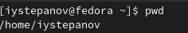
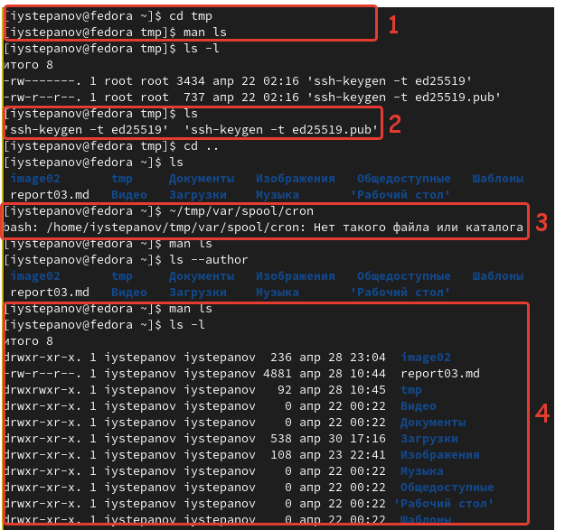
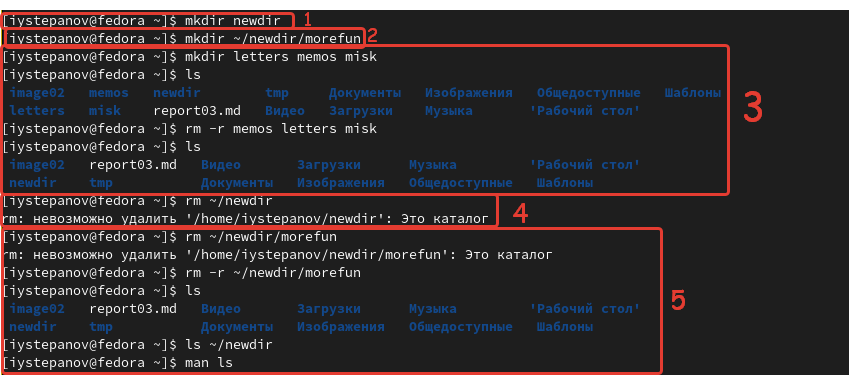
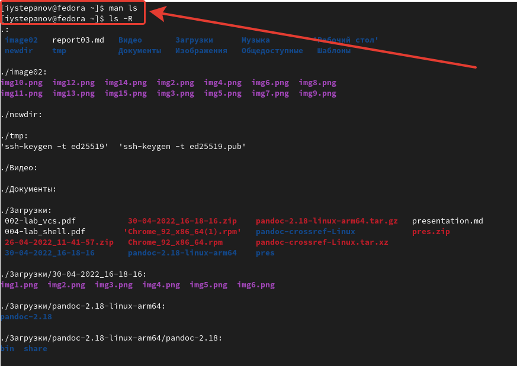
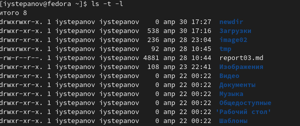
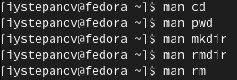

---
## Front matter
lang: ru-RU
title: Отчёт по лабораторной работе №4
author: Степанов Иван Юрьевич
institute: РУДН, Москва, Россия
date: апрель 2022

## Formatting
toc: false
slide_level: 2
theme: metropolis
header-includes: 
 - \metroset{progressbar=frametitle,sectionpage=progressbar,numbering=fraction}
 - '\makeatletter'
 - '\beamer@ignorenonframefalse'
 - '\makeatother'
aspectratio: 43
section-titles: true
---

## Цель работы

Приобретение практических навыков взаимодействия пользователя с системой посредством командной строки.

## домашний каталог

определяю полное имя домашнего каталога

(рис. [-@fig:001])

{ #fig:001 width=70% }

## просмотр содержимого

1. переходим в каталог /tmp
2. выводим на экран содержимое каталога /tmp
3. определяем есть ли в каталоге /var/spool подкаталог с именем cron (по скриншоту видно что такого подкаталога нет)
4. выводим содержимое домашнего каталога с опцией, позволяющей узнать владельца файлов и каталогов.
(рис. [-@fig:002])

{ #fig:002 width=70% }
## создание и удаление
1. создае новым каталог newdir
2. в каталоге newdir создаем новый каталог morefun
3. создаем и затем удаляем 3 новых каталога:letters,memos,misk
4. пробуем удалить каталог ~/newdir, не получилось.
5. удаляем каталог ~/newdir/morefun и проверяем был ли он удален.

(рис. [-@fig:003])

{ #fig:003 width=70% }

## опции ls

с помощью команды man узнаю какую опцию нужно использовть с ls для просмотра содержимового указанного каталога и его подкаталогов

(рис. [-@fig:004])

{ #fig:004 width=70% }

## набор опций ls

с помощью команды man узнаем какой набор опций нужно использовать, чтобы отсортировать по времени список содержимого каталога с развернутым описанием файлов.

(рис. [-@fig:005])

{ #fig:005 width=70% }

## описание

с помощью команды man просматриваю описания команд: cd,pwd,mkdir,rmdir,rm

(рис. [-@fig:006] ) 

{ #fig:006 width=70% }

## history
использую информацию команды history, модифицирую и исполняю команду

{ #fig:006 width=70% }

## Выводы

я получил практические навыки по взаимодействию с системой посредством командной строки, научился пользоваться многими командами, а также узнавать опции этих команд.

## {.standout}

Спасибо за внимание!
