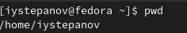
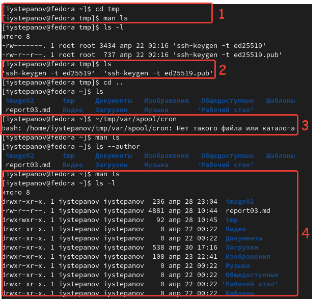
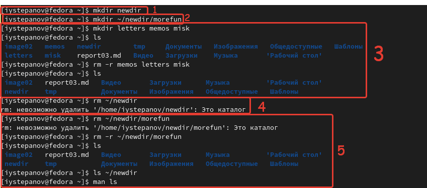
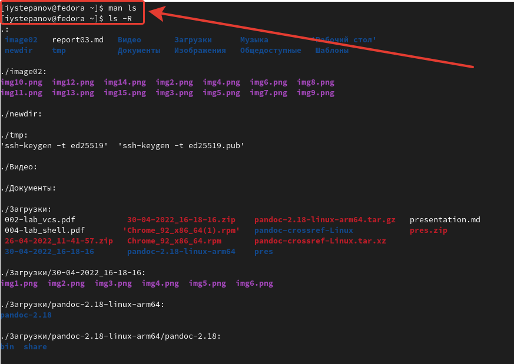
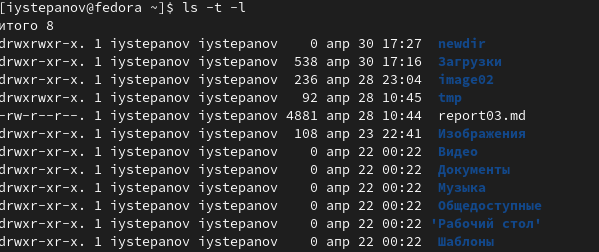
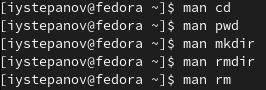

---
## Front matter
title: "Лабораторная работа №4"
author: "Степанов Иван Юрьевич"

## Generic otions
lang: ru-RU
toc-title: "Содержание"

## Bibliography
bibliography: bib/cite.bib
csl: pandoc/csl/gost-r-7-0-5-2008-numeric.csl

## Pdf output format
toc: true # Table of contents
toc-depth: 2
lof: true # List of figures
lot: true # List of tables
fontsize: 12pt
linestretch: 1.5
papersize: a4
documentclass: scrreprt
## I18n polyglossia
polyglossia-lang:
  name: russian
  options:
	- spelling=modern
	- babelshorthands=true
polyglossia-otherlangs:
  name: english
## I18n babel
babel-lang: russian
babel-otherlangs: english
## Fonts
mainfont: PT Serif
romanfont: PT Serif
sansfont: PT Sans
monofont: PT Mono
mainfontoptions: Ligatures=TeX
romanfontoptions: Ligatures=TeX
sansfontoptions: Ligatures=TeX,Scale=MatchLowercase
monofontoptions: Scale=MatchLowercase,Scale=0.9
## Biblatex
biblatex: true
biblio-style: "gost-numeric"
biblatexoptions:
  - parentracker=true
  - backend=biber
  - hyperref=auto
  - language=auto
  - autolang=other*
  - citestyle=gost-numeric
## Pandoc-crossref LaTeX customization
figureTitle: "Рис."
tableTitle: "Таблица"
listingTitle: "Листинг"
lofTitle: "Список иллюстраций"
lotTitle: "Список таблиц"
lolTitle: "Листинги"
## Misc options
indent: true
header-includes:
  - \usepackage{indentfirst}
  - \usepackage{float} # keep figures where there are in the text
  - \floatplacement{figure}{H} # keep figures where there are in the text
---

# Цель работы

Приобретение практических навыков взаимодействия пользователя с системой посредством командной строки.

# Выполнение лабораторной работы

определяю полное имя домашнего каталога

(рис. [-@fig:001])

{ #fig:001 width=70% }

1. переходим в каталог /tmp
2. выводим на экран содержимое каталога /tmp
3. определяем есть ли в каталоге /var/spool подкаталог с именем cron (по скриншоту видно что такого подкаталога нет)
4. выводим содержимое домашнего каталога с опцией, позволяющей узнать владельца файлов и каталогов.
(рис. [-@fig:002])

{ #fig:002 width=70% }

1. создае новым каталог newdir
2. в каталоге newdir создаем новый каталог morefun
3. создаем и затем удаляем 3 новых каталога:letters,memos,misk
4. пробуем удалить каталог ~/newdir, не получилось.
5. удаляем каталог ~/newdir/morefun и проверяем был ли он удален.

(рис. [-@fig:003])

{ #fig:003 width=70% }

с помощью команды man узнаю какую опцию нужно использовть с ls для просмотра содержимового указанного каталога и его подкаталогов

(рис. [-@fig:004])

{ #fig:004 width=70% }

с помощью команды man узнаем какой набор опций нужно использовать, чтобы отсортировать по времени список содержимого каталога с развернутым описанием файлов.

(рис. [-@fig:005])

{ #fig:005 width=70% }

с помощью команды man просматриваю описания команд: cd,pwd,mkdir,rmdir,rm

(рис. [-@fig:006] ) 

{ #fig:006 width=70% }

использую информацию команды history, модифицирую и исполняю команду

{ #fig:006 width=70% }

# Выводы

я получил практические навыки по взаимодействию с системой посредством командной строки, научился пользоваться многими командами, а также узнавать опции этих команд.
