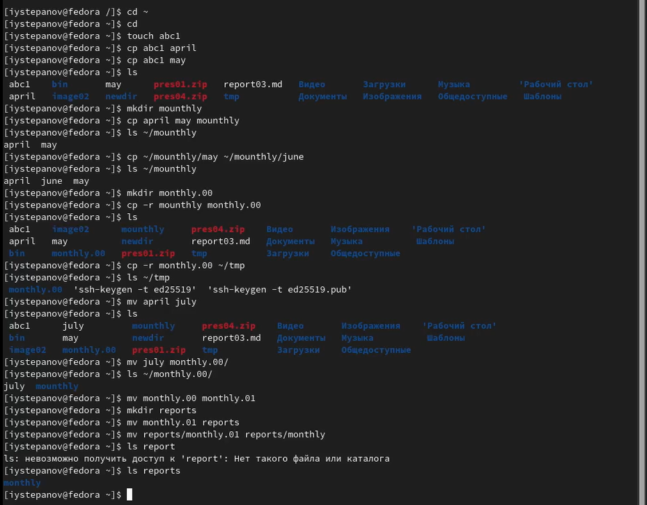
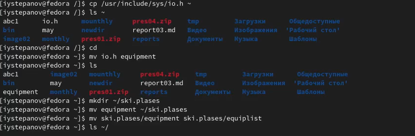
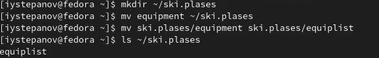
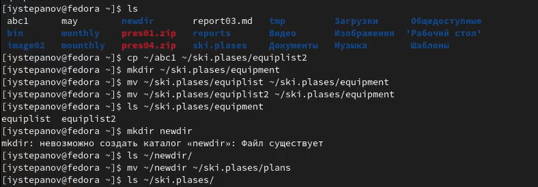
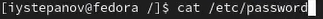
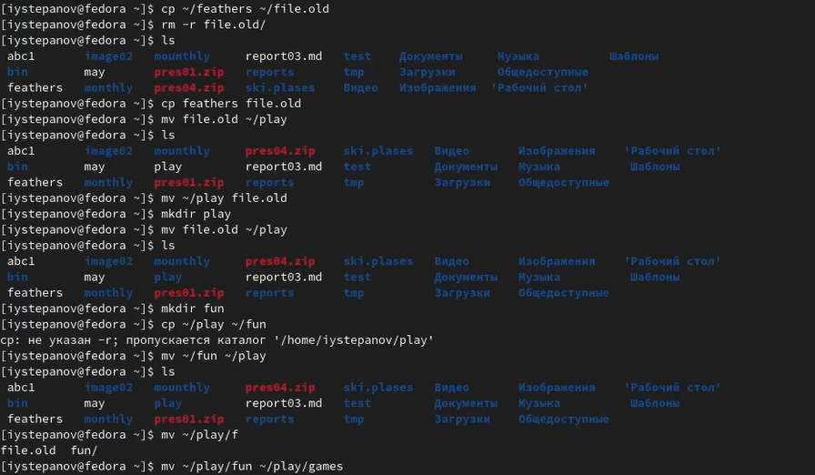
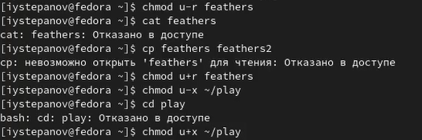
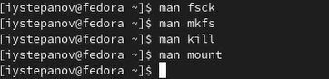

---
## Front matter
lang: ru-RU
title: Отчёт по лабораторной работе №5
author: Степанов Иван Юрьевич
institute: РУДН, Москва, Россия
date: апрель 2022

## Formatting
toc: false
slide_level: 2
theme: metropolis
header-includes: 
 - \metroset{progressbar=frametitle,sectionpage=progressbar,numbering=fraction}
 - '\makeatletter'
 - '\beamer@ignorenonframefalse'
 - '\makeatother'
aspectratio: 43
section-titles: true
---

## Цель работы

Приобретение практических навыков взаимодействия пользователя с системой посредством командной строки.

## выполнение примеров

выполняю все примеры, которые находятся в части описания лабораторной работы, это понадобится для следующего выполнения лабораторной работы.

(рис. [-@fig:001])

{ #fig:001 width=70% }
##копирование
копирую файл /usr/include/sys/io.h в домашний каталог и называю его enquipment

(рис. [-@fig:002])

{ #fig:002 width=70% }
## создание и переименовывание
создаю в домашнем каталоге директорию ski.plases, перемещаю в нее файл enquipment, переименовываю файл enquipment в enquiplist

(рис. [-@fig:003])

{ #fig:003 width=70% }
## создание и перемещение
создаю в домашнем каталоге файл abc1 и копирую его в каталог ~/ski.plases и называю его equiplist2.  
создаю каталог с именем equipment в каталоге ~/ski.plases, перемещаю файлы ~/ski.plases/equiplist и equiplist2 в каталог ~/ski.plases/equipment, создаю и перемещаю каталог ~/newdir в каталог ~/ski.plases и называю
его plans.

(рис. [-@fig:004])

{ #fig:004 width=70% }
## cat
 просматриваю содержимое файла  /etc/password с помощью команды cat
 
(рис. [-@fig:005])

{ #fig:005 width=70% }
## перемещение, копирование, переименовывание
копирую файл ~/feathers в файл ~/file.old, перемещаю файл ~/file.old в каталог ~/play, копирую каталог ~/play в каталог ~/fun, перемещаю каталог ~/fun в каталог ~/play и назовите его games. 

(рис. [-@fig:006])

{ #fig:006 width=70% }
## права
лишаю владельца файла ~/feathers права на чтение, после попытки открыть файл выдает:"отказано в доступе", при копировании выдает то же самое сообщение, обратно даю владельцу файла права на чтение.  
лишаю прав владельца каталога ~/paly права на выполнение, при переходе в каталог выдает:"отказано в доступе", обратно даю право на выполнение.
(рис. [-@fig:007])

{ #fig:007 width=70% }
## man
прочитал man по командам  mount, fsck, mkfs, kill, что дает мне понимаю по использованию этих команд.

(рис. [-@fig:008])

{ #fig:008 width=70% }

## Выводы

я получил практические навыки по использованию команд для работы с файлами и каталогами, а также по управлению процессами, проверке использования диска  и обслуживанию файловой системы.

## {.standout}

Спасибо за внимание!
