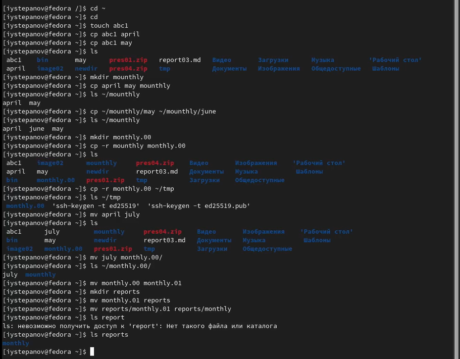
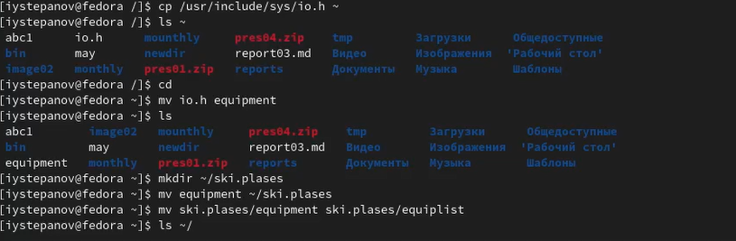
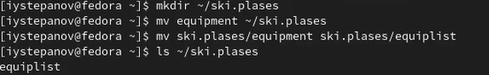
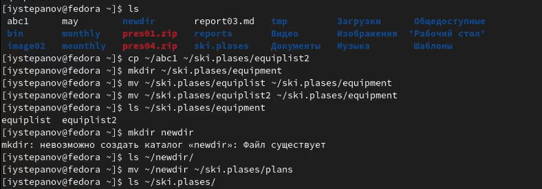
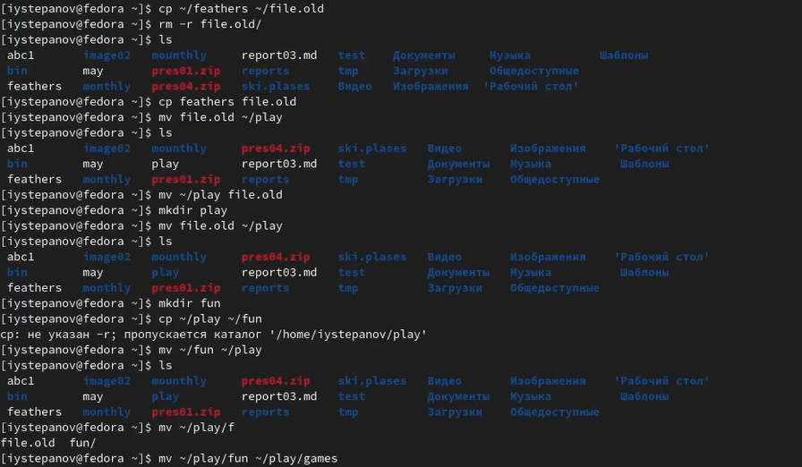
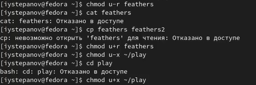
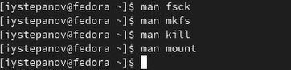

---
## Front matter
title: "Лабораторная работа №5"
author: "Степанов Иван Юрьевич"

## Generic otions
lang: ru-RU
toc-title: "Содержание"

## Bibliography
bibliography: bib/cite.bib
csl: pandoc/csl/gost-r-7-0-5-2008-numeric.csl

## Pdf output format
toc: true # Table of contents
toc-depth: 2
lof: true # List of figures
lot: true # List of tables
fontsize: 12pt
linestretch: 1.5
papersize: a4
documentclass: scrreprt
## I18n polyglossia
polyglossia-lang:
  name: russian
  options:
	- spelling=modern
	- babelshorthands=true
polyglossia-otherlangs:
  name: english
## I18n babel
babel-lang: russian
babel-otherlangs: english
## Fonts
mainfont: PT Serif
romanfont: PT Serif
sansfont: PT Sans
monofont: PT Mono
mainfontoptions: Ligatures=TeX
romanfontoptions: Ligatures=TeX
sansfontoptions: Ligatures=TeX,Scale=MatchLowercase
monofontoptions: Scale=MatchLowercase,Scale=0.9
## Biblatex
biblatex: true
biblio-style: "gost-numeric"
biblatexoptions:
  - parentracker=true
  - backend=biber
  - hyperref=auto
  - language=auto
  - autolang=other*
  - citestyle=gost-numeric
## Pandoc-crossref LaTeX customization
figureTitle: "Рис."
tableTitle: "Таблица"
listingTitle: "Листинг"
lofTitle: "Список иллюстраций"
lotTitle: "Список таблиц"
lolTitle: "Листинги"
## Misc options
indent: true
header-includes:
  - \usepackage{indentfirst}
  - \usepackage{float} # keep figures where there are in the text
  - \floatplacement{figure}{H} # keep figures where there are in the text
---

# Цель работы

Ознакомление с файловой системой Linux, её структурой, именами и содержанием каталогов. Приобретение практических навыков по применению команд для работы с файлами и каталогами, по управлению процессами (и работами), по проверке использования диска и обслуживанию файловой системы.

# Выполнение лабораторной работы

выполняю все примеры, которые находятся в части описания лабораторной работы, это понадобится для следующего выполнения лабораторной работы.

(рис. [-@fig:001])

{ #fig:001 width=70% }

копирую файл /usr/include/sys/io.h в домашний каталог и называю его enquipment

(рис. [-@fig:002])

{ #fig:002 width=70% }

создаю в домашнем каталоге директорию ski.plases, перемещаю в нее файл enquipment, переименовываю файл enquipment в enquiplist

(рис. [-@fig:003])

{ #fig:003 width=70% }

создаю в домашнем каталоге файл abc1 и копирую его в каталог ~/ski.plases и называю его equiplist2.  
создаю каталог с именем equipment в каталоге ~/ski.plases, перемещаю файлы ~/ski.plases/equiplist и equiplist2 в каталог ~/ski.plases/equipment, создаю и перемещаю каталог ~/newdir в каталог ~/ski.plases и называю
его plans.

(рис. [-@fig:004])

{ #fig:004 width=70% }

 просматриваю содержимое файла  /etc/password с помощью команды cat
 
(рис. [-@fig:005])

{ #fig:005 width=70% }

копирую файл ~/feathers в файл ~/file.old, перемещаю файл ~/file.old в каталог ~/play, копирую каталог ~/play в каталог ~/fun, перемещаю каталог ~/fun в каталог ~/play и назовите его games. 

(рис. [-@fig:006])

{ #fig:006 width=70% }

лишаю владельца файла ~/feathers права на чтение, после попытки открыть файл выдает:"отказано в доступе", при копировании выдает то же самое сообщение, обратно даю владельцу файла права на чтение.  
лишаю прав владельца каталога ~/paly права на выполнение, при переходе в каталог выдает:"отказано в доступе", обратно даю право на выполнение.
(рис. [-@fig:007])

{ #fig:007 width=70% }

прочитал man по командам  mount, fsck, mkfs, kill, что дает мне понимаю по использованию этих команд.

(рис. [-@fig:008])

{ #fig:008 width=70% }

# Выводы

я получил практические навыки по использованию команд для работы с файлами и каталогами, а также по управлению процессами, проверке использования диска  и обслуживанию файловой системы.
