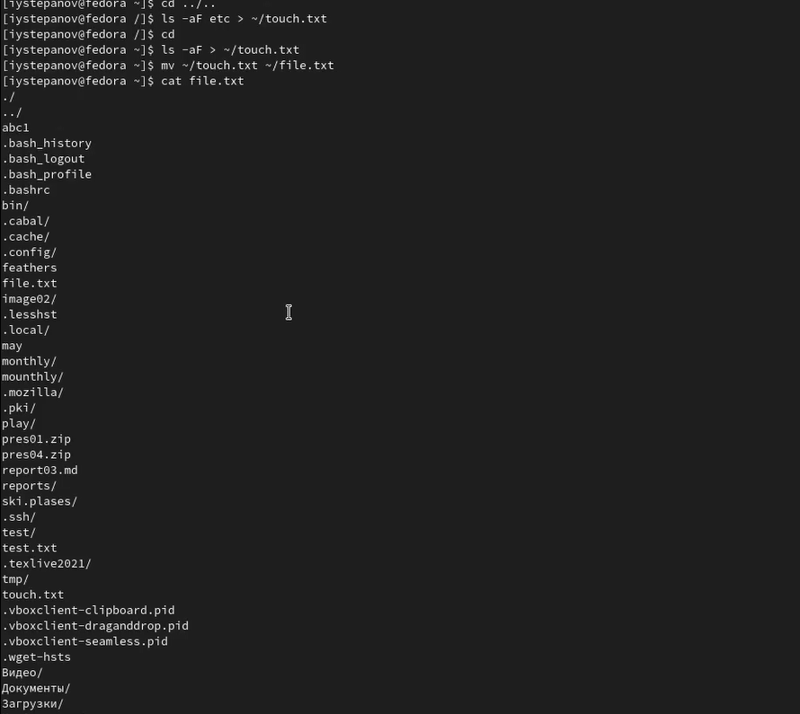
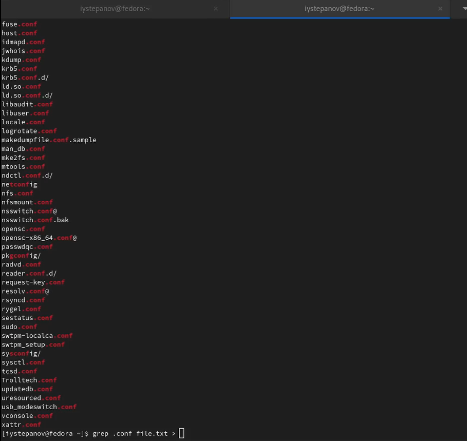
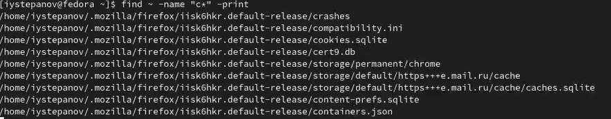
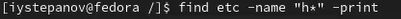
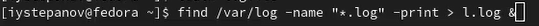
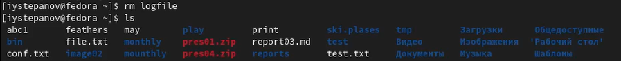
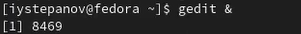
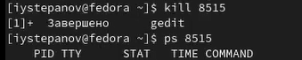
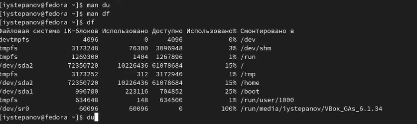

---
## Front matter
lang: ru-RU
title: Отчёт по лабораторной работе №6
author: Степанов Иван Юрьевич
institute: РУДН, Москва, Россия
date: апрель 2022

## Formatting
toc: false
slide_level: 2
theme: metropolis
header-includes: 
 - \metroset{progressbar=frametitle,sectionpage=progressbar,numbering=fraction}
 - '\makeatletter'
 - '\beamer@ignorenonframefalse'
 - '\makeatother'
aspectratio: 43
section-titles: true
---

## Цель работы

Ознакомление с инструментами поиска файлов и фильтрации текстовых данных.
Приобретение практических навыков: по управлению процессами (и заданиями), по
проверке использования диска и обслуживанию файловых систем.

## запись в файл

записываю в файл file.txt название файлов содержащихся в каталоге etc, а также добавляю туда названия файлов из домашнего каталога.

(рис. [-@fig:001])

{ #fig:001 width=70% }
## выведение из файла
вывожу названия всех файлов с расширением .conf в консоль и записываю их в новый файл conf.txt

(рис. [-@fig:002])

{ #fig:002 width=70% }
## поиск с фильтром
определяю какие файлы в домашнем каталоге имеют имена начинающиюся с "с".

(рис. [-@fig:003])

{ #fig:003 width=70% }
## поиск с фильтром
вывожу на экран имена файлов из каталога /etc которые начинаются на на "h"

(рис. [-@fig:004])

{ #fig:004 width=70% }
## фоновый режим
запускаю в фоновом режиме процесс, который записывает в файл logfile все файлы, которые начинаются с log
 
(рис. [-@fig:005])

{ #fig:005 width=70% }
## удаление ненужных файлов
удаляю logfile.
(рис. [-@fig:006])

{ #fig:006 width=70% }
## фоновый режим]
запускаю в фоновом режиме редактор gedit.

(рис. [-@fig:007])

{ #fig:007 width=70% }
## man kill
читаю справку по команде kill, после чего завершаю процесс gedit.

(рис. [-@fig:008])

{ #fig:008 width=70% }
## выполнение команд
выполняю команды df и du

(рис. [-@fig:009])

{ #fig:009 width=70% }
## find
с помощью команды find вывожу имена всех директорий в домашнем каталоге

(рис. [-@fig:010])

{ #fig:010 width=70% }

## Выводы

я ознакомился с инструментами поиска файлов и фильтрации текстовых данных, а также на практике приобрел навыки по управлению процессами, а так работы с командами для поиска и фильтрации.

## {.standout}

Спасибо за внимание!
