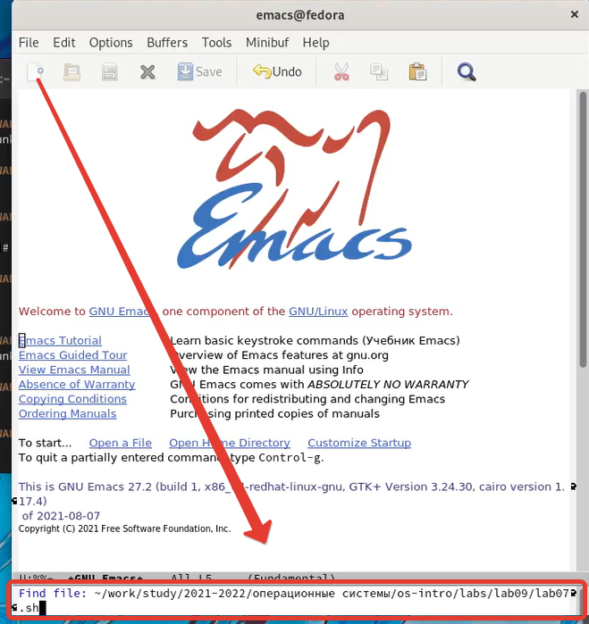
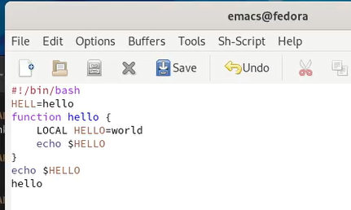
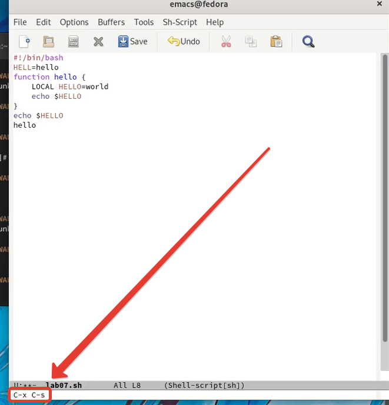
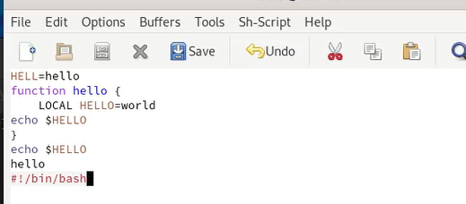
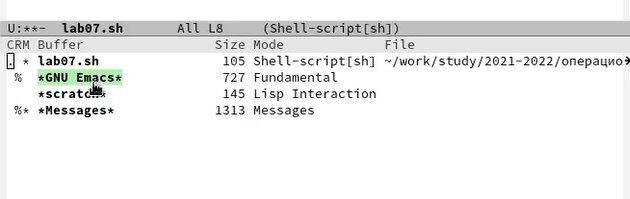
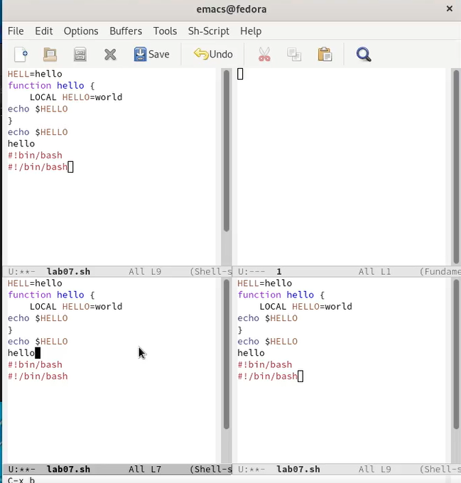
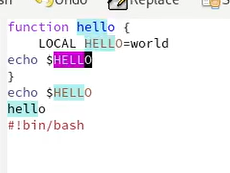
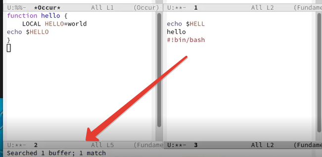

---
## Front matter
lang: ru-RU
title: Отчёт по лабораторной работе №9
author: Степанов Иван Юрьевич
institute: РУДН, Москва, Россия
date: апрель 2022

## Formatting
toc: false
slide_level: 2
theme: metropolis
header-includes: 
 - \metroset{progressbar=frametitle,sectionpage=progressbar,numbering=fraction}
 - '\makeatletter'
 - '\beamer@ignorenonframefalse'
 - '\makeatother'
aspectratio: 43
section-titles: true
---

## Цель работы

Познакомиться с операционной системой Linux. Получить практические навыки работы с редактором Emacs.

## lab07.sh

создаю файл lab07.sh

(рис. [-@fig:001])

{ #fig:001 width=70% }

## текст
 
набираю текст представленный на картинке

(рис. [-@fig:002])

{ #fig:002 width=70% }

## сохранение
 
сохраняю файл с помощью комбинаций клавиш С-x С-s

(рис. [-@fig:003])

{ #fig:003 width=70% }

## редактирование
 
проделываю с текстом разные процедуры редактирования(копирование, вырезание, вставка и так далее)

(рис. [-@fig:004])

{ #fig:004 width=70% }

## список буферов
 
вывожу список активных буферов

(рис. [-@fig:005])

{ #fig:005 width=70% }

## деление фрейма]
 
делю фрейм на 4 части, позже в каждом окне создаю по новому файлу

рис. [-@fig:006])

{ #fig:006 width=70% }

## поиск
 
с помощью поиска нахожу слова в тексте

(рис. [-@fig:007])

{ #fig:007 width=70% }

## другой поиск
 
с помощью другого поиска нахожу количество слов

(рис. [-@fig:008])

{ #fig:008 width=70% }

## Выводы
я получил практические навыки по работе с редактором emacs, а также научился в нем работать.

## {.standout}

Спасибо за внимание!
