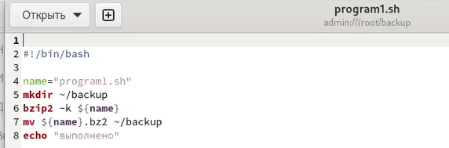
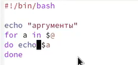
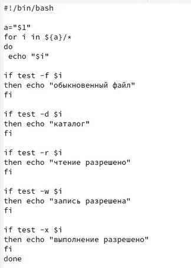
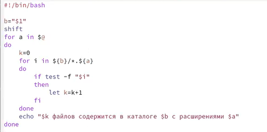

---
## Front matter
lang: ru-RU
title: Отчёт по лабораторной работе №10
author: Степанов Иван Юрьевич
institute: РУДН, Москва, Россия
date: апрель 2022

## Formatting
toc: false
slide_level: 2
theme: metropolis
header-includes: 
 - \metroset{progressbar=frametitle,sectionpage=progressbar,numbering=fraction}
 - '\makeatletter'
 - '\beamer@ignorenonframefalse'
 - '\makeatother'
aspectratio: 43
section-titles: true
---

## Цель работы

Изучить основы программирования в оболочке ОС UNIX/Linux. Научиться писать
небольшие командные файлы.

## первый скрипт

(рис. [-@fig:001])

{ #fig:001 width=70% }

## второй скрипт

(рис. [-@fig:002])

{ #fig:002 width=70% }

## третий скрипт

(рис. [-@fig:003])

{ #fig:003 width=70% }

## четвертый скрипт

(рис. [-@fig:004])

{ #fig:004 width=70% }

## Выводы

я научился писать небольшие командные файлы, а также изучил основы программирования в оболочке линукс

## {.standout}

Спасибо за внимание!
