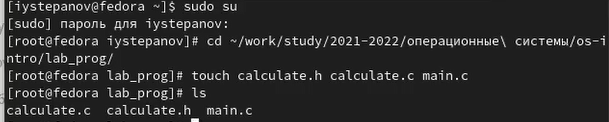
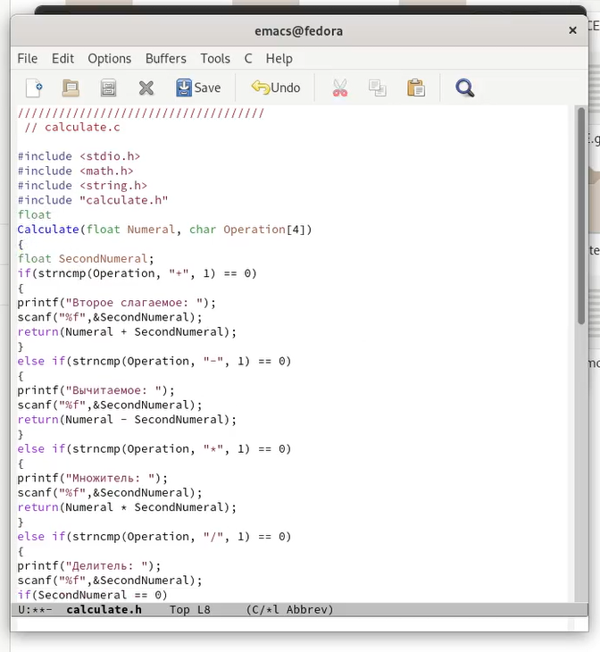
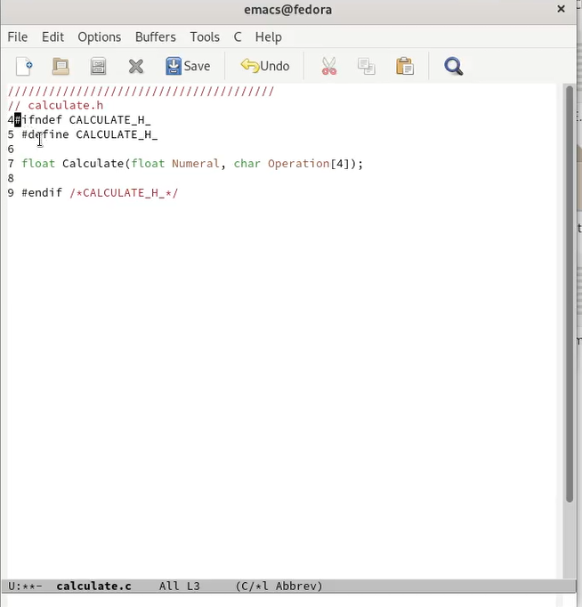
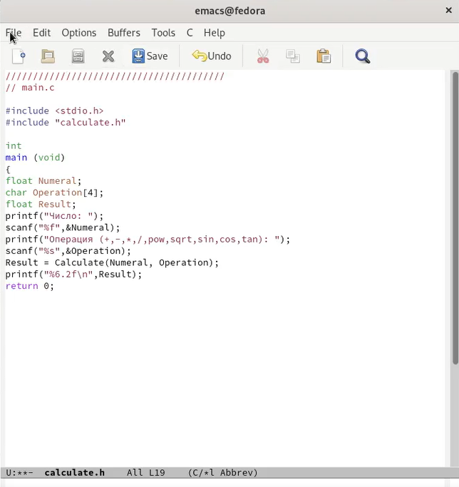
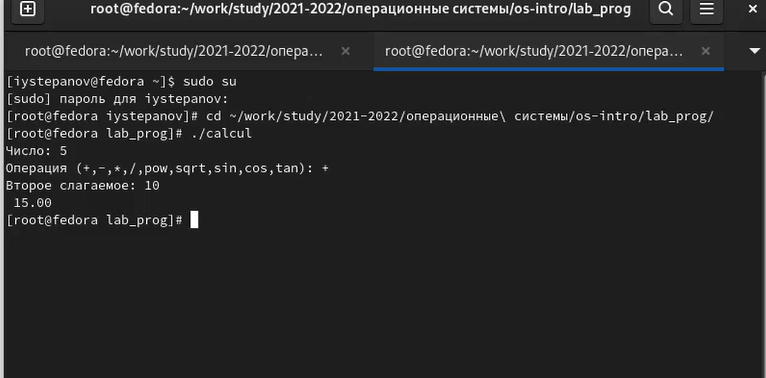

---
## Front matter
lang: ru-RU
title: Отчёт по лабораторной работе №13
author: Степанов Иван Юрьевич
institute: РУДН, Москва, Россия
date: апрель 2022

## Formatting
toc: false
slide_level: 2
theme: metropolis
header-includes: 
 - \metroset{progressbar=frametitle,sectionpage=progressbar,numbering=fraction}
 - '\makeatletter'
 - '\beamer@ignorenonframefalse'
 - '\makeatother'
aspectratio: 43
section-titles: true
---

## Цель работы

Приобрести простейшие навыки разработки, анализа, тестирования и отладки приложений в ОС типа UNIX/Linux на примере создания на языке программирования
С калькулятора с простейшими функциями.

## Выполнение лабораторной работы

## создаю файлы

(рис. [-@fig:001])

{ #fig:001 width=70% }

## переписываю программу для калькулятора

(рис. [-@fig:002])

{ #fig:002 width=70% }

## 

(рис. [-@fig:003])

{ #fig:003 width=70% }

##

(рис. [-@fig:004])

{ #fig:004 width=70% }

## проверяю работу программы

(рис. [-@fig:005])

{ #fig:005 width=70% }

## Выводы

я приобрел простейшие навыки разработки и тестирования программам на примере создания калькулятора с простейшими функиями

## {.standout}

Спасибо за внимание!
