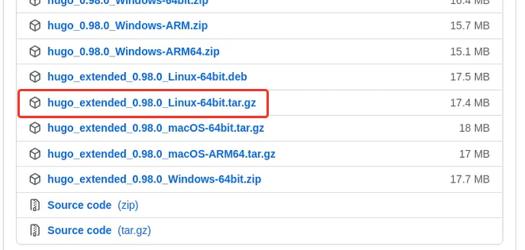
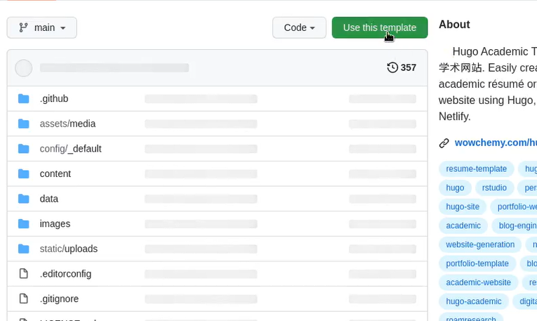
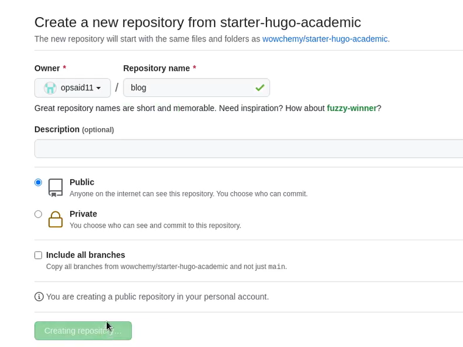
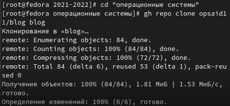
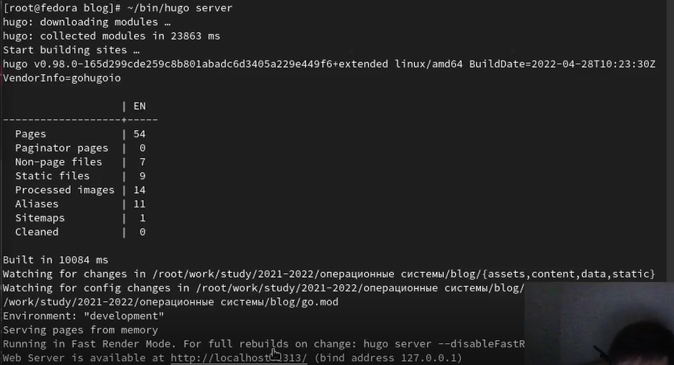
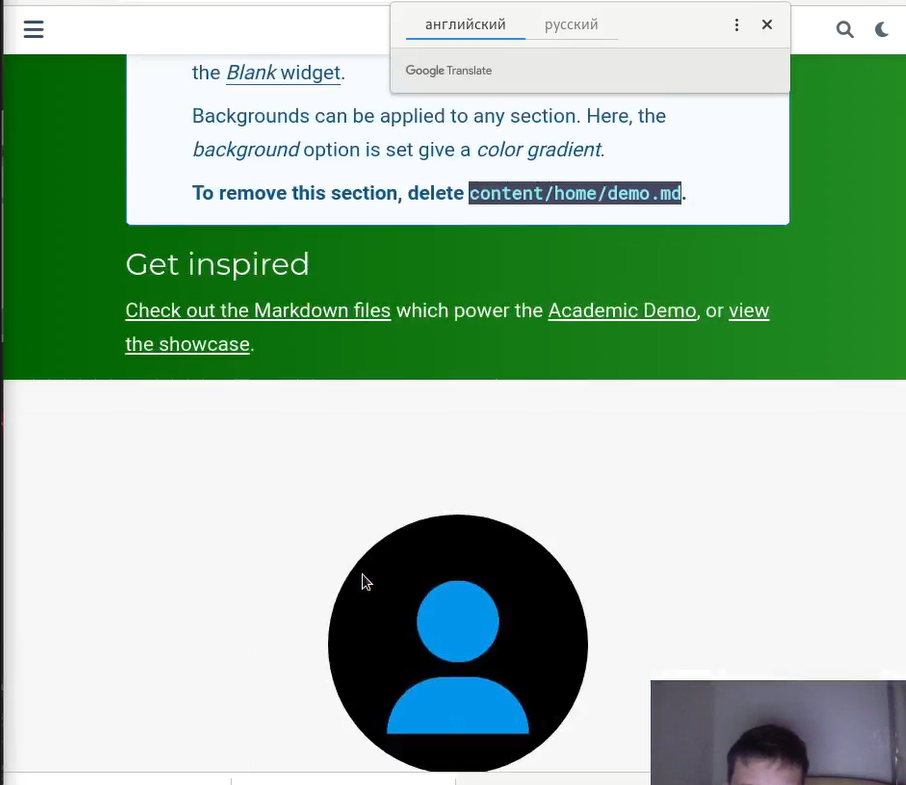
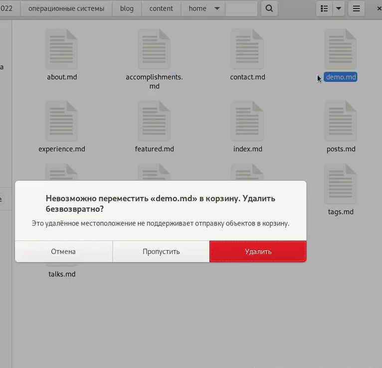
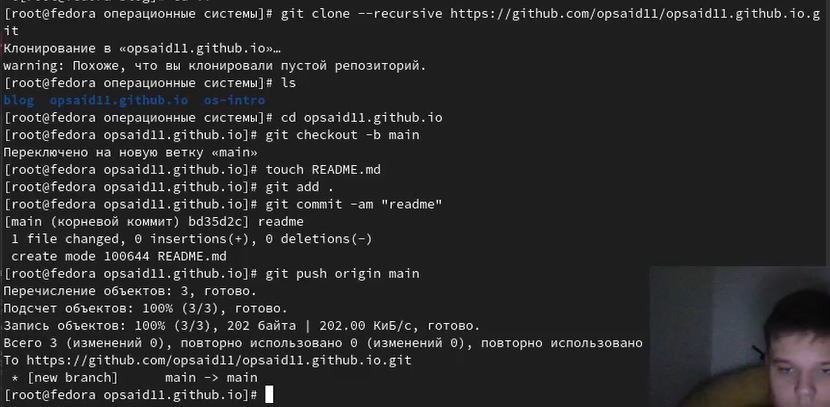
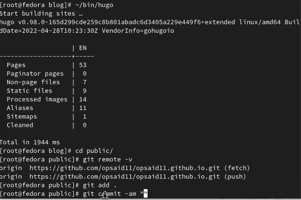
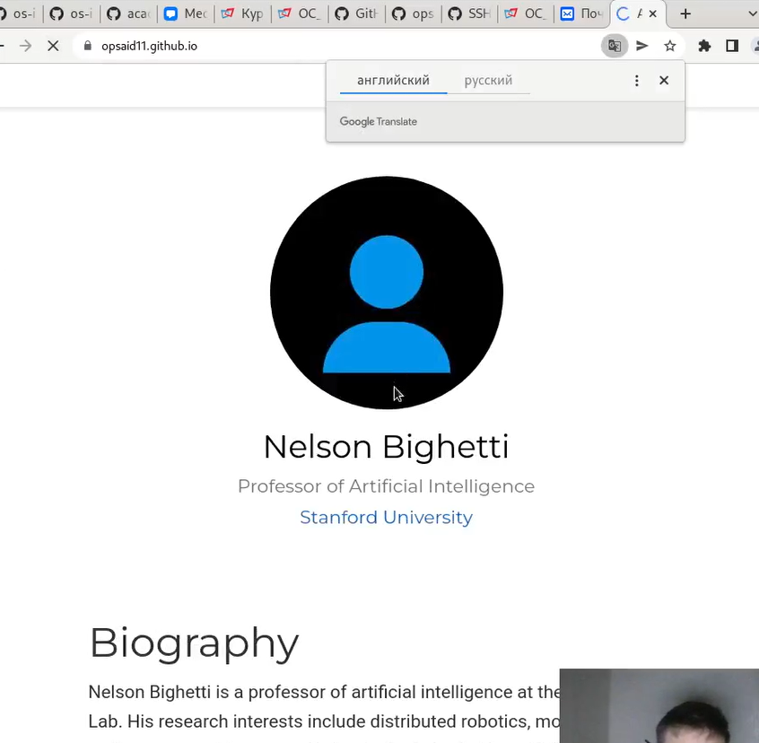

---
## Front matter
lang: ru-RU
title: Отчёт по индвидуальному проекту, этап 1
author: Степанов Иван Юрьевич
institute: РУДН, Москва, Россия
date: апрель 2022

## Formatting
toc: false
slide_level: 2
theme: metropolis
header-includes: 
 - \metroset{progressbar=frametitle,sectionpage=progressbar,numbering=fraction}
 - '\makeatletter'
 - '\beamer@ignorenonframefalse'
 - '\makeatother'
aspectratio: 43
section-titles: true
---

## Цель работы

создание сайта

## Задание

Размещение на Github pages заготовки для персонального сайта.

- Установить необходимое программное обеспечение.
- Скачать шаблон темы сайта.
- Разместить его на хостинге git.
- Установить параметр для URLs сайта.
- Разместить заготовку сайта на Github pages.

## установка hugo

скачиваем hugo, он понадобится для создания сайта

(рис. [-@fig:001])

{ #fig:001 width=70% }

## новый репозиторий

создаем новый репозитирой у себя на гитхабе, основой которого будет являтся шаблон.
(рис. [-@fig:002])

{ #fig:002 width=70% }

## новый репозиторий

новый репозиторий blog
(рис. [-@fig:002])

{ #fig:002 width=70% }

## клонирование нового репозитория

клонируем новый репозиторий к себе на компьютер

(рис. [-@fig:003])

{ #fig:003 width=70% }

## создание локального хоста

запускаем файл hugo, который создает локальный хост, можно со своего компьютера в браузере посмотреть заготовку для сайта.

(рис. [-@fig:004])

{ #fig:004 width=70% }

## сайт на локальном хосте

сайт на локальном хосте

(рис. [-@fig:005])

{ #fig:005 width=70% }

## удаление ненужных файлов

удаляем файл demo, который отвечает за часть сайта, где находится информация о разработчиках и их поддержке.

(рис. [-@fig:006] ) 

{ #fig:006 width=70% }

## репозиторий для сайта на гитхаб

создание пустого репозитория и его клонирование.

(рис. [-@fig:007] ) 

{ #fig:007 width=70% }

## запуск hugo

запуск файла hugo создания сайта

(рис. [-@fig:008] ) 

{ #fig:008 width=70% }

## сайт на гитхабе

сайт, который запускается с помощью гитхаба, следовательно его можно просматривать с любого устройства.

(рис. [-@fig:009] ) 

{ #fig:009 width=70% }

## Выводы

я научился создавать заготовку для сайта по шаблону, а так же открывать его не только локально, но и с помощью гитхаба на любом устройстве

## {.standout}

Спасибо за внимание!
