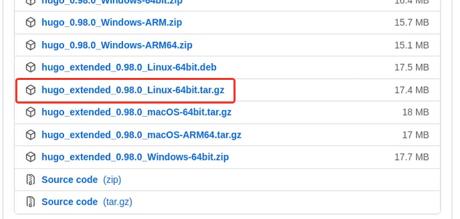
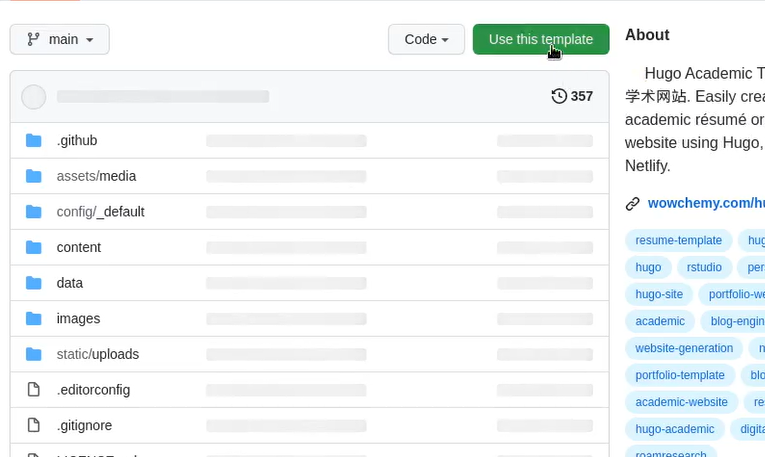
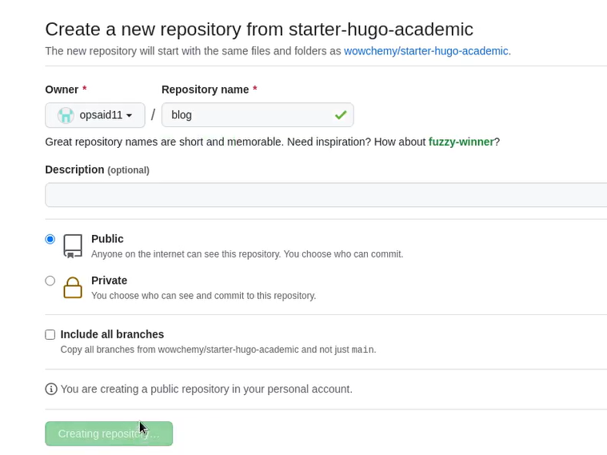
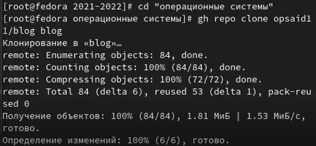
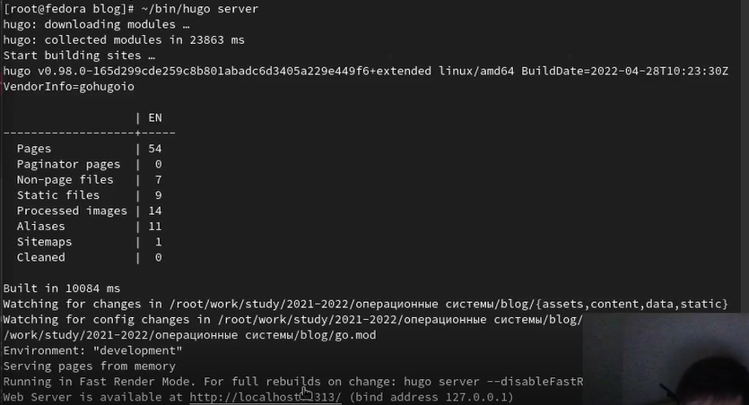
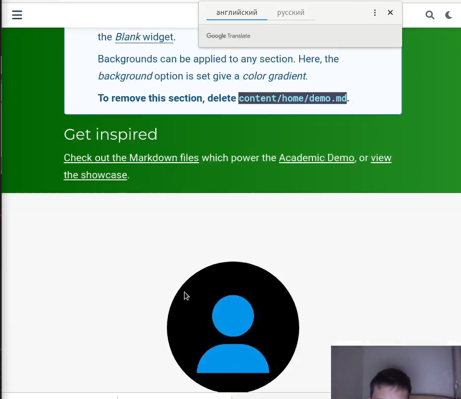
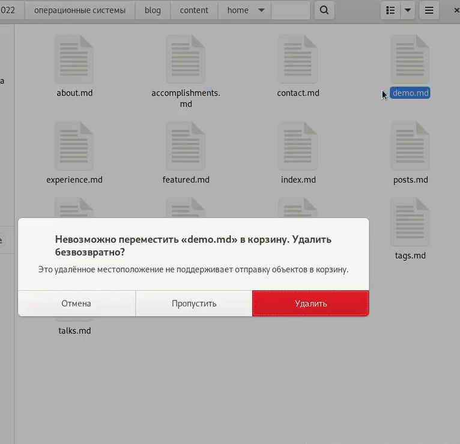
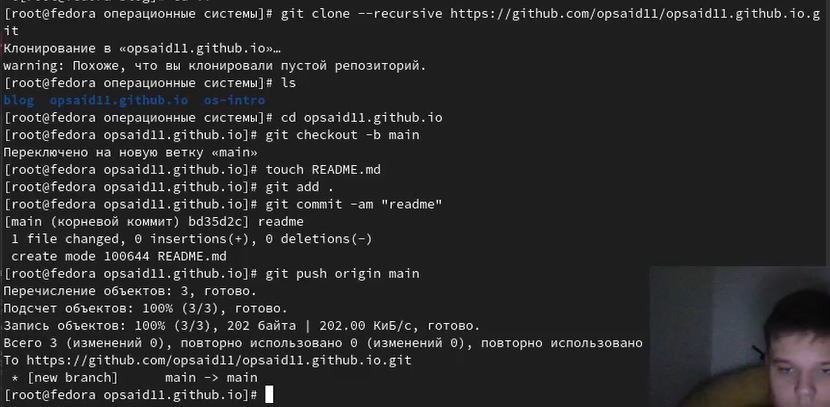
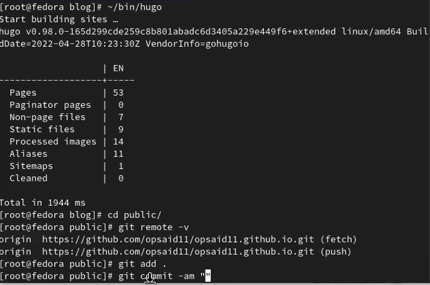
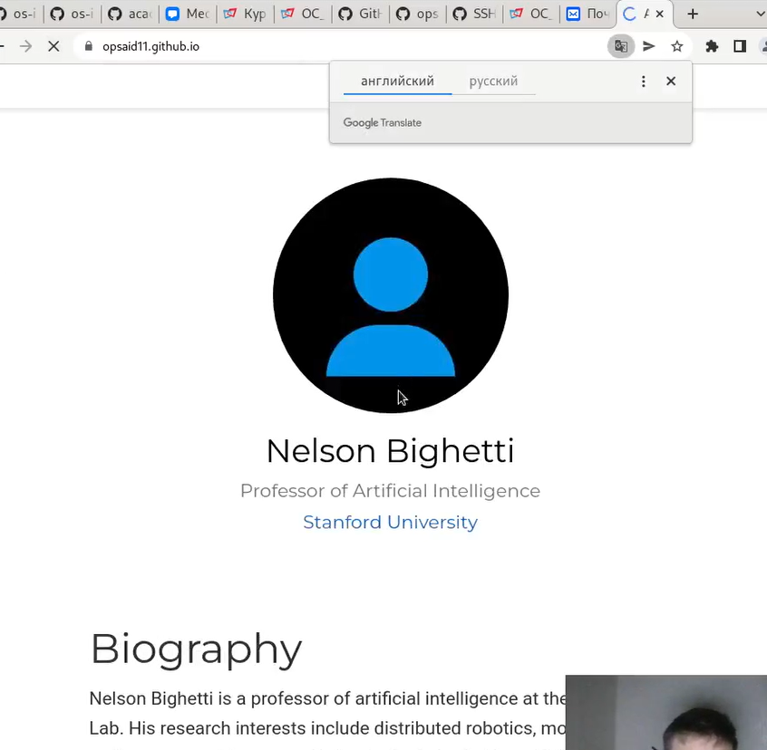

---
## Front matter
title: "Индивидуальный проект. 1 этап"
author: "Степанов Иван Юрьевич"

## Generic otions
lang: ru-RU
toc-title: "Содержание"

## Bibliography
bibliography: bib/cite.bib
csl: pandoc/csl/gost-r-7-0-5-2008-numeric.csl

## Pdf output format
toc: true # Table of contents
toc-depth: 2
lof: true # List of figures
lot: true # List of tables
fontsize: 12pt
linestretch: 1.5
papersize: a4
documentclass: scrreprt
## I18n polyglossia
polyglossia-lang:
  name: russian
  options:
	- spelling=modern
	- babelshorthands=true
polyglossia-otherlangs:
  name: english
## I18n babel
babel-lang: russian
babel-otherlangs: english
## Fonts
mainfont: PT Serif
romanfont: PT Serif
sansfont: PT Sans
monofont: PT Mono
mainfontoptions: Ligatures=TeX
romanfontoptions: Ligatures=TeX
sansfontoptions: Ligatures=TeX,Scale=MatchLowercase
monofontoptions: Scale=MatchLowercase,Scale=0.9
## Biblatex
biblatex: true
biblio-style: "gost-numeric"
biblatexoptions:
  - parentracker=true
  - backend=biber
  - hyperref=auto
  - language=auto
  - autolang=other*
  - citestyle=gost-numeric
## Pandoc-crossref LaTeX customization
figureTitle: "Рис."
tableTitle: "Таблица"
listingTitle: "Листинг"
lofTitle: "Список иллюстраций"
lotTitle: "Список таблиц"
lolTitle: "Листинги"
## Misc options
indent: true
header-includes:
  - \usepackage{indentfirst}
  - \usepackage{float} # keep figures where there are in the text
  - \floatplacement{figure}{H} # keep figures where there are in the text
---

# Цель работы

создание сайта

# Задание

Размещение на Github pages заготовки для персонального сайта.

Установить необходимое программное обеспечение.
Скачать шаблон темы сайта.
Разместить его на хостинге git.
Установить параметр для URLs сайта.
Разместить заготовку сайта на Github pages.

# Выполнение лабораторной работы

скачиваем hugo, он понадобится для создания сайта

(рис. [-@fig:001])

{ #fig:001 width=70% }

создаем новый репозитирой у себя на гитхабе, основой которого будет являтся шаблон.
(рис. [-@fig:002])

{ #fig:002 width=70% }

новый репозиторий blog
(рис. [-@fig:002])

{ #fig:002 width=70% }

клонируем новый репозиторий к себе на компьютер

(рис. [-@fig:003])

{ #fig:003 width=70% }

запускаем файл hugo, который создает локальный хост, можно со своего компьютера в браузере посмотреть заготовку для сайта.

(рис. [-@fig:004])

{ #fig:004 width=70% }

сайт на локальном хосте

(рис. [-@fig:005])

{ #fig:005 width=70% }

удаляем файл demo, который отвечает за часть сайта, где находится информация о разработчиках и их поддержке.

(рис. [-@fig:006] ) 

{ #fig:006 width=70% }

создание пустого репозитория и его клонирование.

(рис. [-@fig:007] ) 

{ #fig:007 width=70% }

запуск файла hugo создания сайта

(рис. [-@fig:008] ) 

{ #fig:008 width=70% }

сайт, который запускается с помощью гитхаба, следовательно его можно просматривать с любого устройства.

(рис. [-@fig:009] ) 

{ #fig:009 width=70% }

# Выводы

я научился создавать заготовку для сайта по шаблону, а так же открывать его не только локально, но и с помощью гитхаба на любом устройстве
