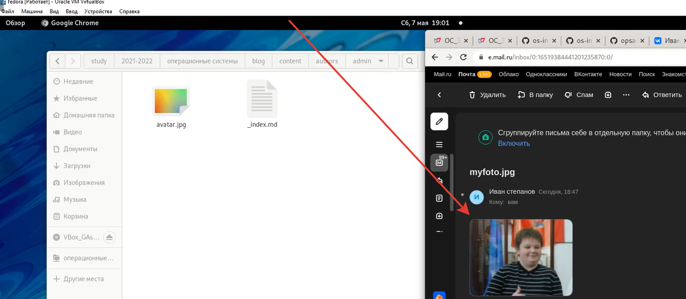
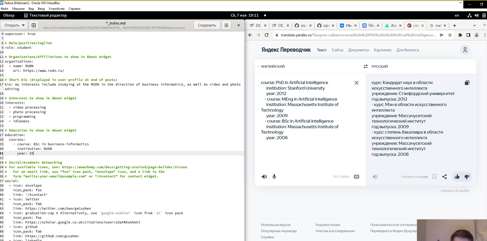
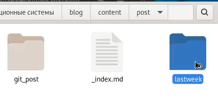
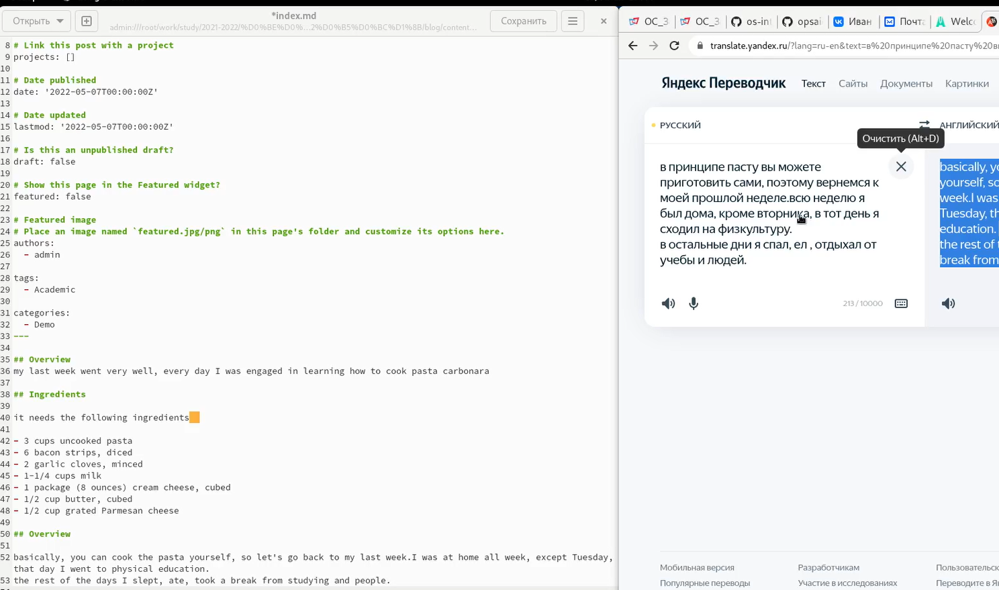
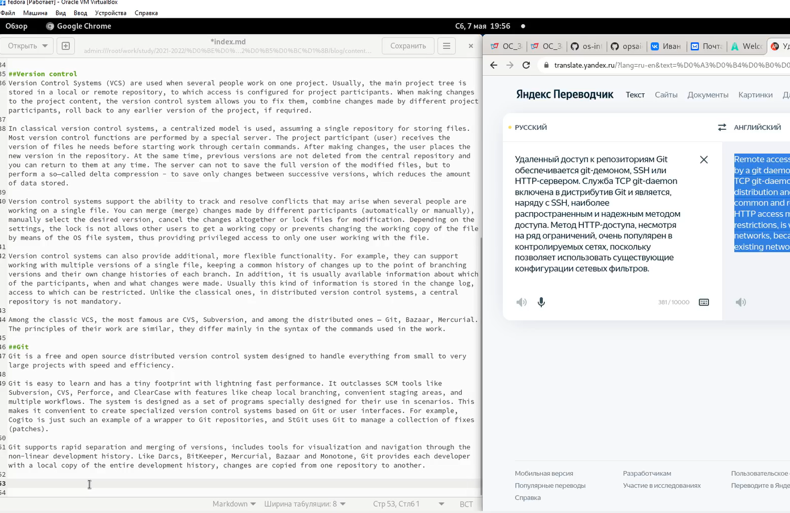

---
## Front matter
lang: ru-RU
title: Отчёт по индвидуальному проекту, этап 2
author: Степанов Иван Юрьевич
institute: РУДН, Москва, Россия
date: апрель 2022

## Formatting
toc: false
slide_level: 2
theme: metropolis
header-includes: 
 - \metroset{progressbar=frametitle,sectionpage=progressbar,numbering=fraction}
 - '\makeatletter'
 - '\beamer@ignorenonframefalse'
 - '\makeatother'
aspectratio: 43
section-titles: true
---

## Цель работы

создание сайта

## Задание

- Разместить фотографию владельца сайта.
- Разместить краткое описание владельца сайта (Biography).
- Добавить информацию об интересах (Interests).
- Добавить информацию от образовании (Education).
- Сделать пост по прошедшей неделе.
- пост на тему: управление версиями. Git.

## аватар

сначала я меняю аватар на сайте на свой.

(рис. [-@fig:001])

{ #fig:001 width=70% }
## информация
редактирую информацию о владельце сайта: переделываю краткое описание владельца сайта, добавляю информацию об интересах, а также добавляю информацию об образовании

(рис. [-@fig:002])

{ #fig:002 width=70% }
## заготовки для постов]
создаю 2 папки для постов: один по прошедшей неделе, другой по управлению версиями гит.
(рис. [-@fig:002])

{ #fig:002 width=70% }
## написание поста 1
пишу пост по прошедшей неделе

(рис. [-@fig:003])

{ #fig:003 width=70% }
## написание поста 2
пишу пост по управлению версиями гит.

(рис. [-@fig:004])

{ #fig:004 width=70% }
## сайт
сам сайт можно увидеть по ссылке прикрепленной в туис.

## Выводы

я научился редактировать информацию на сайте, заполнил данные об владельце сайта (о себе), а также написал 2 поста.

## {.standout}

Спасибо за внимание!
