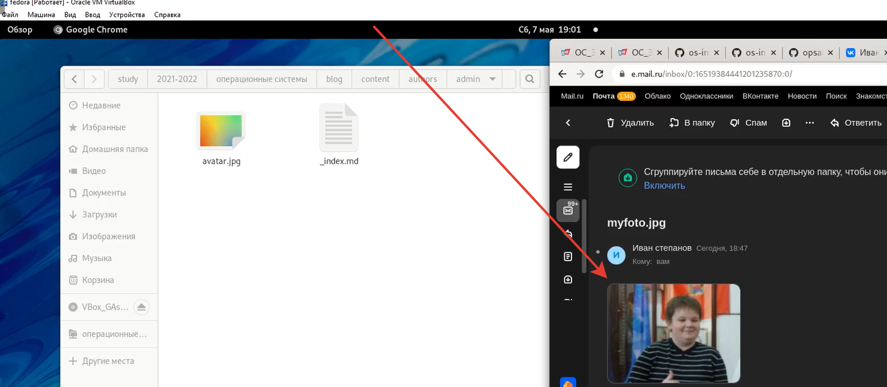
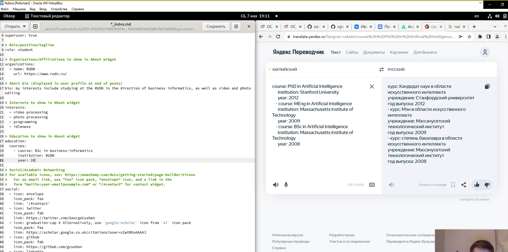
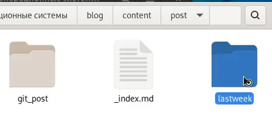
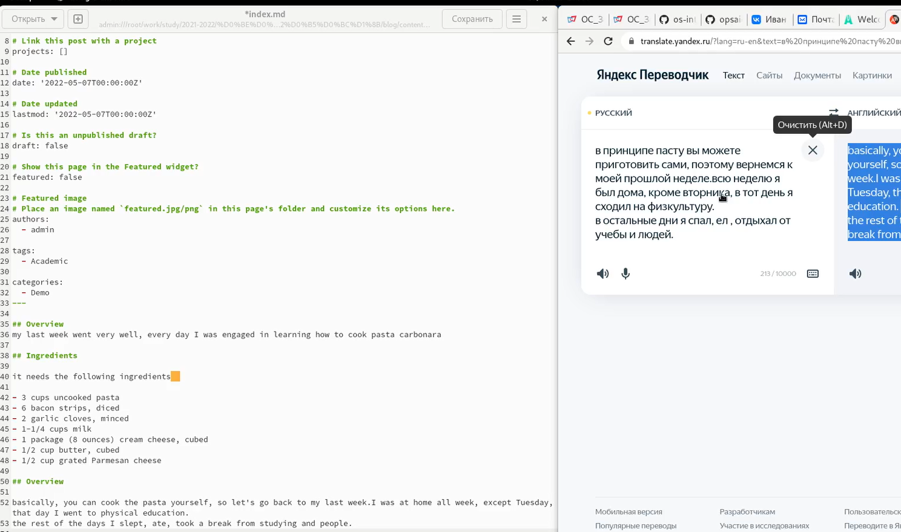
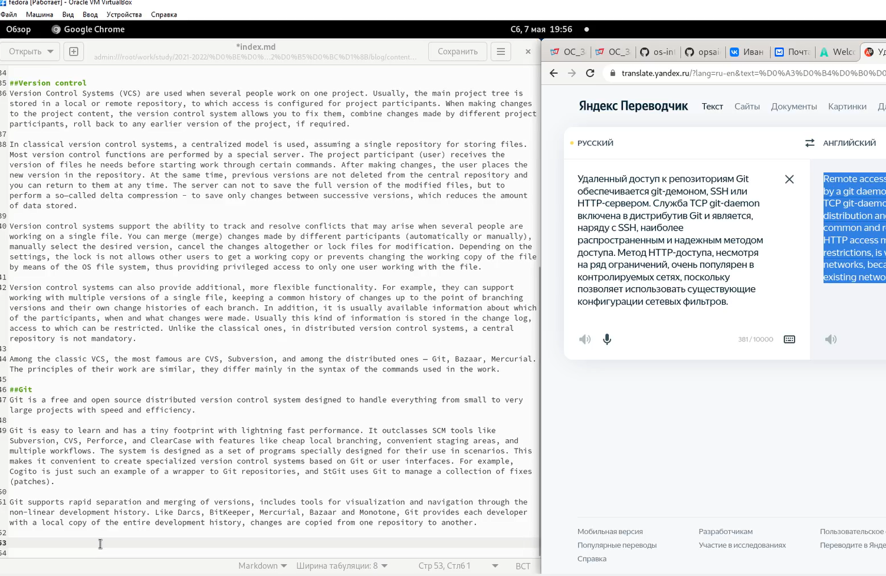

---
## Front matter
title: "Индивидуальный проект. 2 этап"
author: "Степанов Иван Юрьевич"

## Generic otions
lang: ru-RU
toc-title: "Содержание"

## Bibliography
bibliography: bib/cite.bib
csl: pandoc/csl/gost-r-7-0-5-2008-numeric.csl

## Pdf output format
toc: true # Table of contents
toc-depth: 2
lof: true # List of figures
lot: true # List of tables
fontsize: 12pt
linestretch: 1.5
papersize: a4
documentclass: scrreprt
## I18n polyglossia
polyglossia-lang:
  name: russian
  options:
	- spelling=modern
	- babelshorthands=true
polyglossia-otherlangs:
  name: english
## I18n babel
babel-lang: russian
babel-otherlangs: english
## Fonts
mainfont: PT Serif
romanfont: PT Serif
sansfont: PT Sans
monofont: PT Mono
mainfontoptions: Ligatures=TeX
romanfontoptions: Ligatures=TeX
sansfontoptions: Ligatures=TeX,Scale=MatchLowercase
monofontoptions: Scale=MatchLowercase,Scale=0.9
## Biblatex
biblatex: true
biblio-style: "gost-numeric"
biblatexoptions:
  - parentracker=true
  - backend=biber
  - hyperref=auto
  - language=auto
  - autolang=other*
  - citestyle=gost-numeric
## Pandoc-crossref LaTeX customization
figureTitle: "Рис."
tableTitle: "Таблица"
listingTitle: "Листинг"
lofTitle: "Список иллюстраций"
lotTitle: "Список таблиц"
lolTitle: "Листинги"
## Misc options
indent: true
header-includes:
  - \usepackage{indentfirst}
  - \usepackage{float} # keep figures where there are in the text
  - \floatplacement{figure}{H} # keep figures where there are in the text
---

# Цель работы

создание сайта

# Задание

- Разместить фотографию владельца сайта.
- Разместить краткое описание владельца сайта (Biography).
- Добавить информацию об интересах (Interests).
- Добавить информацию от образовании (Education).
- Сделать пост по прошедшей неделе.
- пост на тему: управление версиями. Git.

# Выполнение лабораторной работы

сначала я меняю аватар на сайте на свой.

(рис. [-@fig:001])

{ #fig:001 width=70% }

редактирую информацию о владельце сайта: переделываю краткое описание владельца сайта, добавляю информацию об интересах, а также добавляю информацию об образовании

(рис. [-@fig:002])

{ #fig:002 width=70% }

создаю 2 папки для постов: один по прошедшей неделе, другой по управлению версиями гит.
(рис. [-@fig:002])

{ #fig:002 width=70% }

пишу пост по прошедшей неделе

(рис. [-@fig:003])

{ #fig:003 width=70% }

пишу пост по управлению версиями гит.

(рис. [-@fig:004])

{ #fig:004 width=70% }

сам сайт можно увидеть по ссылке прикрепленной в туис.

# Выводы

я научился редактировать информацию на сайте, заполнил данные об владельце сайта (о себе), а также написал 2 поста.
