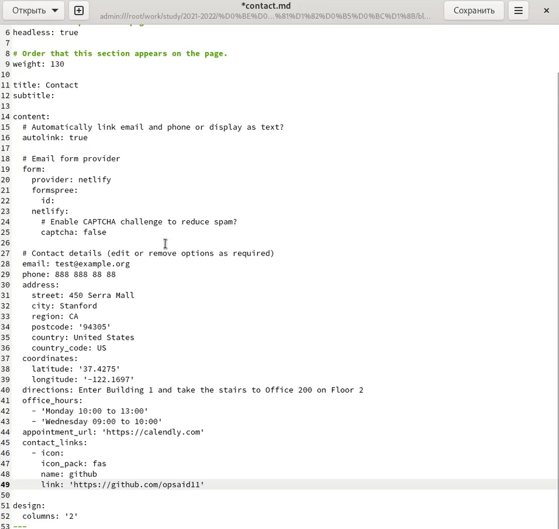
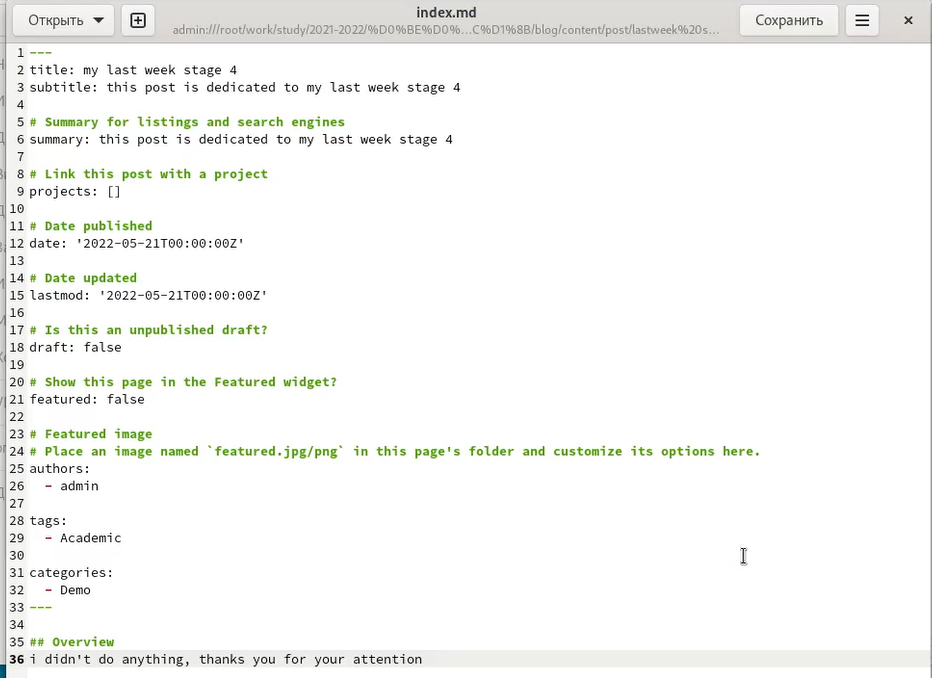
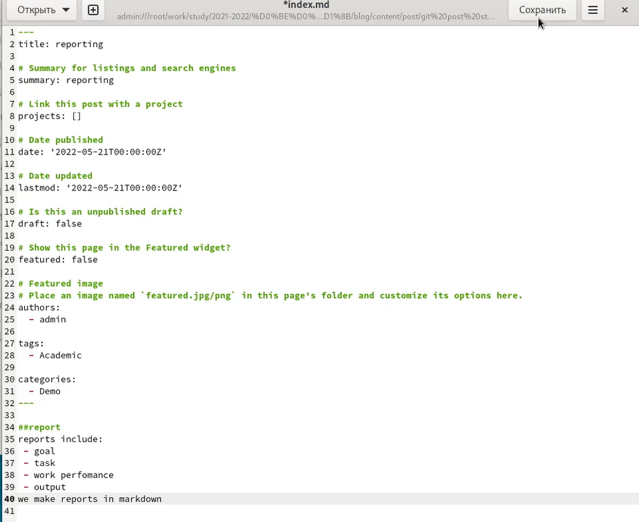

---
## Front matter
lang: ru-RU
title: Отчёт по индвидуальному проекту, этап 4
author: Степанов Иван Юрьевич
institute: РУДН, Москва, Россия
date: апрель 2022

## Formatting
toc: false
slide_level: 2
theme: metropolis
header-includes: 
 - \metroset{progressbar=frametitle,sectionpage=progressbar,numbering=fraction}
 - '\makeatletter'
 - '\beamer@ignorenonframefalse'
 - '\makeatother'
aspectratio: 43
section-titles: true
---

## Цель работы

создание персонального сайта

## Задание

 - разместить ссылки на сайты
 - написать пост по прошедшей неделе
 - написать пост про оформление отчета

## ссылки

размещаю ссылки на сайты

(рис. [-@fig:001])

{ #fig:001 width=70% }

## прошедшая неделя
пишу пост по прошедшей неделе

(рис. [-@fig:002])

{ #fig:002 width=70% }

## оформление отчетов
пишу пост про оформление отчета
(рис. [-@fig:002])

{ #fig:002 width=70% }

## Выводы
я оставил ссылки на свои профили, а также написал 2 поста.

## {.standout}

Спасибо за внимание!
