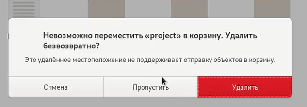
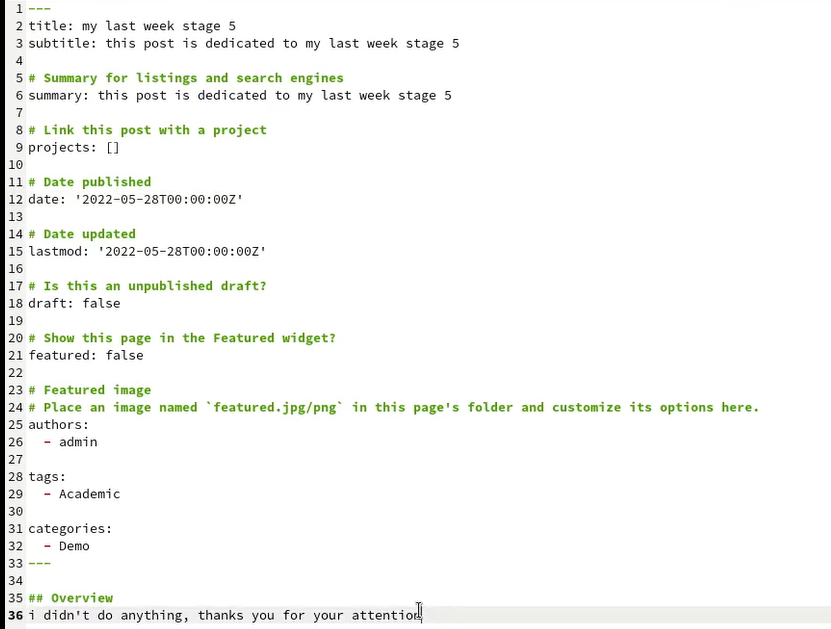
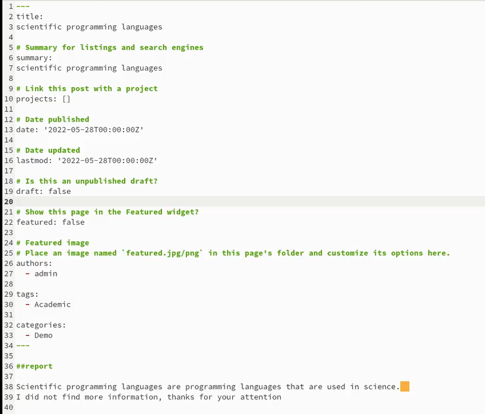

---
## Front matter
lang: ru-RU
title: Отчёт по индвидуальному проекту, этап 5
author: Степанов Иван Юрьевич
institute: РУДН, Москва, Россия
date: апрель 2022

## Formatting
toc: false
slide_level: 2
theme: metropolis
header-includes: 
 - \metroset{progressbar=frametitle,sectionpage=progressbar,numbering=fraction}
 - '\makeatletter'
 - '\beamer@ignorenonframefalse'
 - '\makeatother'
aspectratio: 43
section-titles: true
---

## Цель работы

создание персонального сайта

## Задание

- Сделать записи для персональных проектов.
- Сделать пост по прошедшей неделе.
- Языки научного программирования.

## проекты

удаляю вкладку проекты, потому что у меня их нет

(рис. [-@fig:001])

{ #fig:001 width=70% }

## прошедшая неделя

пишу пост по прошедшей неделе

(рис. [-@fig:002])

{ #fig:002 width=70% }

## языки научного программирования

пишу пост про языки научного программирования
(рис. [-@fig:003])

{ #fig:003 width=70% }

## Выводы
я убрал вкладку проекты, а также написал 2 поста.

## {.standout}

Спасибо за внимание!
